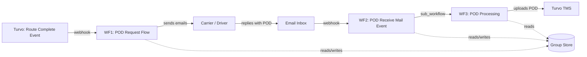
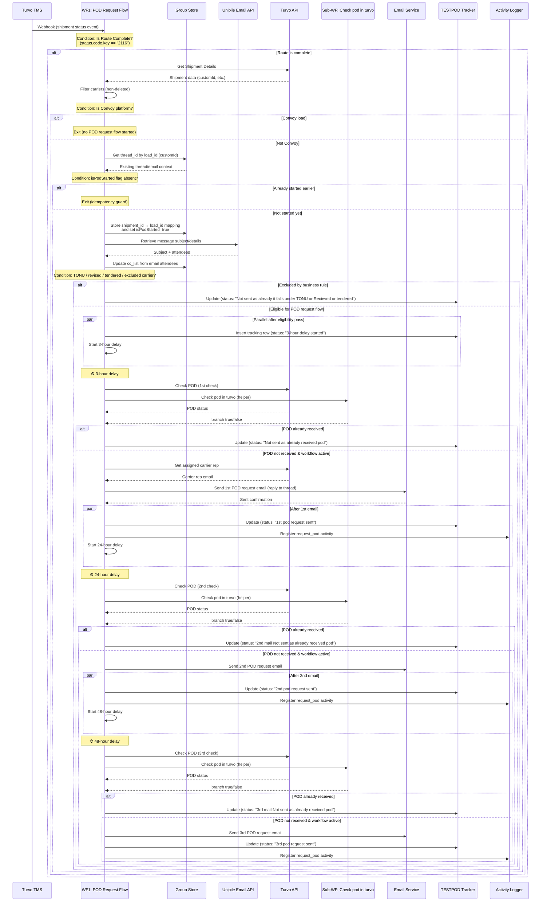
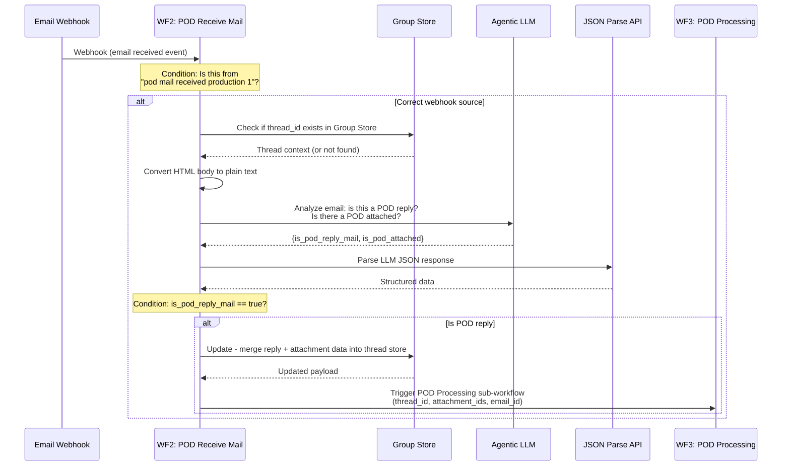
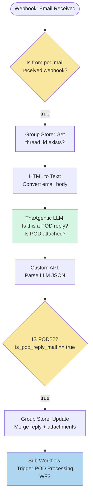
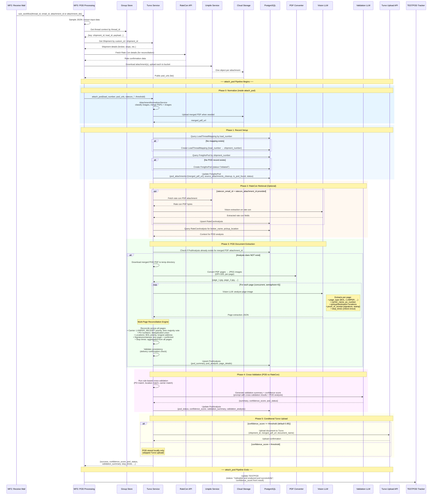
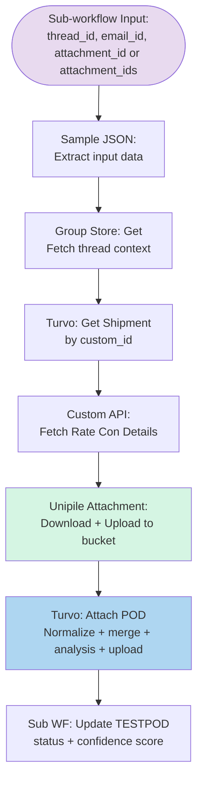
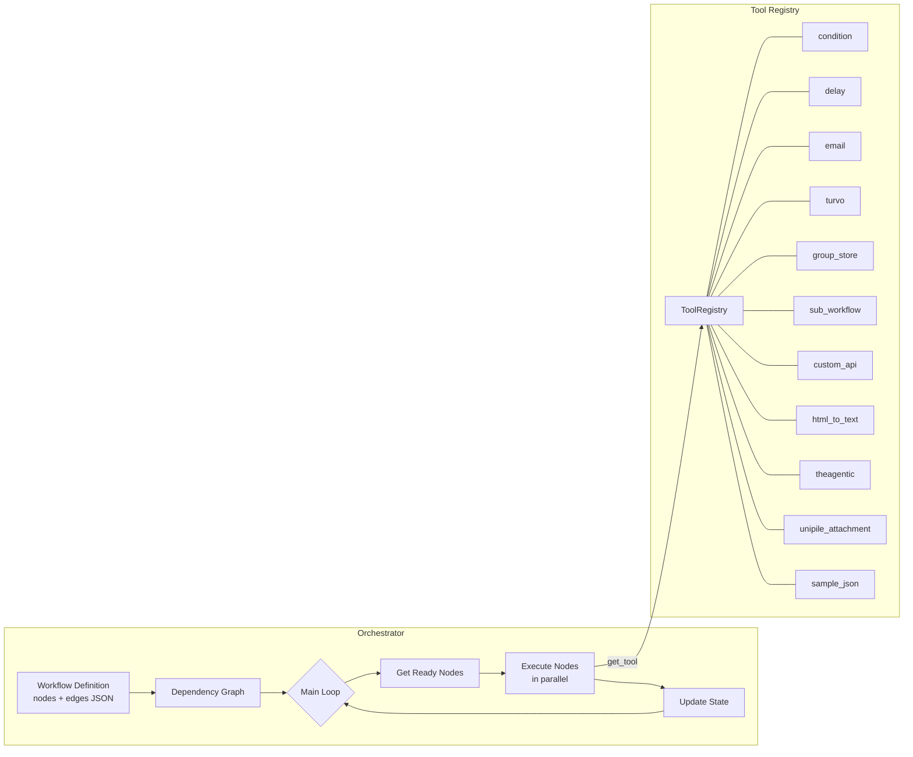
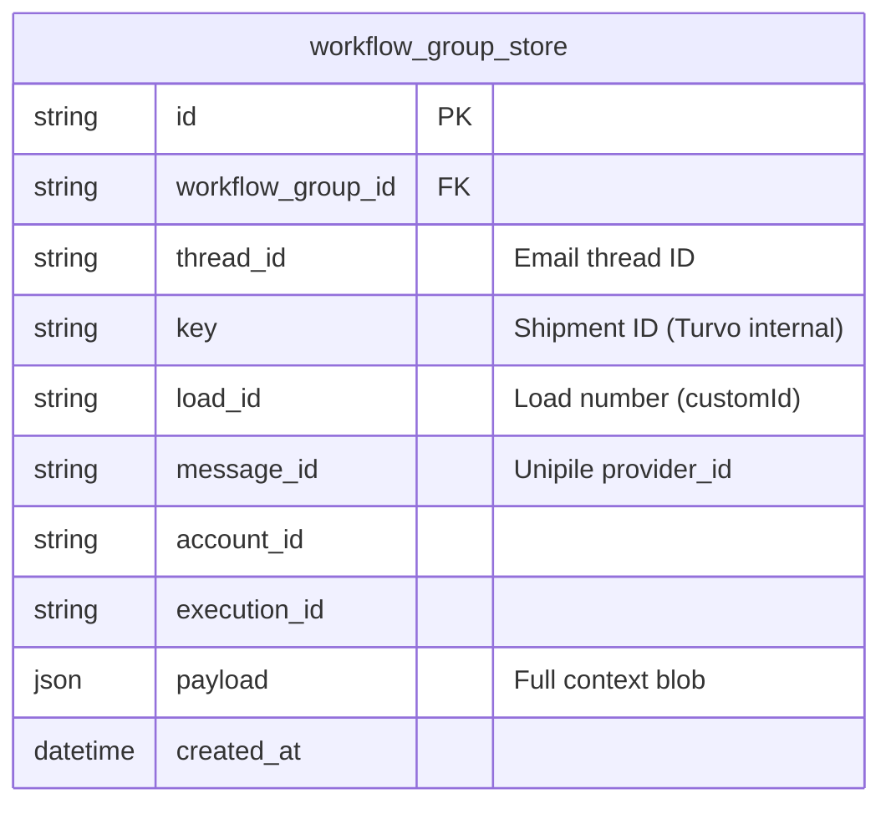

```mermaid
flowchart TD
    trigger([Webhook Trigger]) --> cond_route{Is Route Complete?<br/>status.code.key == 2116}

    cond_route -->|true| get_shipment[Turvo: Get Shipment]
    get_shipment --> filter_carriers[JSON Filter: CarrierOrder deleted != true]
    filter_carriers --> cond_convoy{Is Convoy platform?}

    cond_convoy -->|false| get_thread[Group Store: Get thread_id]
    get_thread --> cond_started{isPodStarted flag missing?}
    cond_started -->|true| store_mapping[Group Store: Update shipment/thread + isPodStarted]

    store_mapping --> fetch_subject[API: Retrieve email details]
    fetch_subject --> cond_tonu{TONU/revised/tendered/excluded carrier?}
    fetch_subject --> update_cc[Group Store: Update cc_list]

    cond_tonu -->|true| track_skip_tonu[Sub WF: Update TESTPOD<br/>TONU/revised/tendered skip]
    cond_tonu -->|false| delay_3h[⏱ 3-Hour Delay]
    delay_3h --> track_insert[Sub WF: Insert TESTPOD row]

    delay_3h --> check_pod_1[Turvo: Check POD]
    check_pod_1 --> check_pod_sub_1[Sub WF: Check pod in turvo]
    check_pod_sub_1 --> cond_pod_1{POD Exists?<br/>turvo OR helper sub-wf}

    cond_pod_1 -->|true| track_already_1[Sub WF: Update - already received]
    cond_pod_1 -->|false| cond_active_1{Workflow Active?}

    cond_active_1 -->|true| get_rep[Turvo: Get assigned carrier rep]
    get_rep --> cc_emails[Sample JSON: Build CC list]
    cc_emails --> email_1[📧 Send 1st POD Request]

    email_1 --> track_sent_1[Sub WF: Update - 1st request sent]
    email_1 --> activity_1[API: Register request_pod]
    email_1 --> delay_24h[⏱ 24-Hour Delay]

    delay_24h --> check_pod_2[Turvo: Check POD Copy]
    check_pod_2 --> check_pod_sub_2[Sub WF: Check pod in turvo Copy]
    check_pod_sub_2 --> cond_pod_2{POD Exists? Copy<br/>turvo OR helper sub-wf}

    cond_pod_2 -->|true| track_already_2[Sub WF: Update - 2nd not sent]
    cond_pod_2 -->|false| cond_active_2{Workflow Active? Copy}

    cond_active_2 -->|true| email_2[📧 Send 2nd POD Request]

    email_2 --> track_sent_2[Sub WF: Update - 2nd request sent]
    email_2 --> activity_2[API: Register request_pod Copy]
    email_2 --> delay_48h[⏱ 48-Hour Delay]

    delay_48h --> check_pod_3[Turvo: Check POD Copy Copy]
    check_pod_3 --> check_pod_sub_3[Sub WF: Check pod in turvo Copy Copy]
    check_pod_sub_3 --> cond_pod_3{POD Exists? Copy Copy<br/>turvo OR helper sub-wf}

    cond_pod_3 -->|true| track_already_3[Sub WF: Update - 3rd not sent]
    cond_pod_3 -->|false| cond_active_3{Workflow Active? Copy Copy}

    cond_active_3 -->|true| email_3[📧 Send 3rd POD Request]

    email_3 --> track_sent_3[Sub WF: Update - 3rd request sent]
    email_3 --> activity_3[API: Register request_pod Copy Copy]

    style cond_route fill:#f9e79f
    style cond_convoy fill:#f9e79f
    style cond_started fill:#f9e79f
    style cond_tonu fill:#f9e79f
    style cond_pod_1 fill:#f9e79f
    style cond_pod_2 fill:#f9e79f
    style cond_pod_3 fill:#f9e79f
    style cond_active_1 fill:#d5f5e3
    style cond_active_2 fill:#d5f5e3
    style cond_active_3 fill:#d5f5e3
    style email_1 fill:#aed6f1
    style email_2 fill:#aed6f1
    style email_3 fill:#aed6f1
    style delay_3h fill:#fadbd8
    style delay_24h fill:#fadbd8
    style delay_48h fill:#fadbd8
```

# POD (Proof of Delivery) Workflow System

> **Document type:** Explanation  
> **Audience:** Backend and full-stack developers working on FreightX  
> **Scope:** The three graph-based POD workflows, their orchestrator engine, shared state, database models, and the POD processing agent pipeline.

---

## Table of Contents

- [Overview](#overview)
- [Workflow 1 — Post Delivery POD Request Flow](#workflow-1--post-delivery-pod-request-flow)
- [Workflow 2 — Post Delivery POD Receive Mail Event](#workflow-2--post-delivery-pod-receive-mail-event)
- [Workflow 3 — Post Delivery POD Processing](#workflow-3--post-delivery-pod-processing)
- [Multi-attachment pipeline (`attach_pod`)](#multi-attachment-pipeline-attach_pod)
- [Common Infrastructure](#common-infrastructure)
- [Database Schema](#database-schema)
- [Frontend Integration](#frontend-integration)
- [Debugging Guide](#debugging-guide)

---

## Overview

The POD system automates the entire proof-of-delivery lifecycle for freight shipments. It consists of **three interconnected graph-based workflows** that run on the FreightX workflow orchestrator engine:

| # | Workflow | ID | Trigger | Purpose |
|---|----------|----|---------|---------|
| 1 | **Post Delivery POD Request Flow** | `d828f9d3-a580-4d05-bfc3-88e9b5b94268` | Webhook (Turvo event) | Sends up to 3 escalating POD request emails after route completion |
| 2 | **Post Delivery POD Receive Mail Event** | `b5cff8d8-2fcd-4c95-8944-d6f32767dee8` | Webhook (inbound email) | Detects if an inbound email is a POD reply and triggers processing |
| 3 | **Post Delivery POD Processing** | `1b5604d9-85a7-42cf-ab50-490f661a08cb` | Sub-workflow (called by Workflow 2) | Fetches each attachment from email, merges into one PDF, runs AI analysis, then uploads that PDF to Turvo |

All three workflows share a **common Group Store** (`8b935ef9-e227-4846-b697-9b4b8d896c84`) that correlates shipments to email threads, enabling cross-workflow state.

### High-Level Data Flow



---

## Workflow 1 — Post Delivery POD Request Flow

**ID:** `d828f9d3-a580-4d05-bfc3-88e9b5b94268`  
**Trigger:** Webhook (Turvo shipment status event)  
**Purpose:** After a route is marked complete in Turvo, this workflow performs
eligibility guards (Convoy exclusion, duplicate-run guard, TONU/revised/tendered
exclusion), then sends up to three POD request emails at escalating intervals
(3h → 24h → 48h), checking at each step whether the POD has already been
received.

### Sequence Diagram



### Node Graph



### Node Breakdown

| Node | Type | Description |
|------|------|-------------|
| `condition-1772028976743` | `condition` | Entry gate: checks `$eventPayload.status.code.key == "2116"` (route complete) |
| `turvo-1773704382227` | `turvo` | `get_shipment` — fetches shipment details by `$trigger.eventPayload.id` |
| `json_filter-1775154796276` | `json_filter` | Filters deleted carrier rows before Convoy check |
| `condition-1775154805675` | `condition` | Convoy exclusion gate (`"Convoy"` carrier) |
| `group_store-1772650691671` | `group_store` | `Get` — looks up existing email thread for this shipment's `customId` |
| `condition-1775757686005` | `condition` | Idempotency guard: only proceeds when `isPodStarted` is not already set |
| `group_store-1773700796502` | `group_store` | `Update` — stores `shipment_id → load_id` mapping in Group Store |
| `custom_api-1774632772138` | `custom_api` | Fetches source email details (subject + attendees) from Unipile |
| `group_store-1774646223531` | `group_store` | Updates Group Store with derived `cc_list` |
| `condition-1774632811803` | `condition` | Skips flow for TONU/revised/tendered/excluded carrier cases |
| `delay-1772867129922` | `delay` | 3-hour delay before first POD check |
| `turvo-1773178060865` | `turvo` | `check_pod` — checks if POD already uploaded in Turvo |
| `sub_workflow-1774630060991` | `sub_workflow` | Helper workflow `Check pod in turvo` (workflow `745e0d51-f0db-4389-8d0f-b8e15d53992a`) |
| `condition-1773178144927` | `condition` | 1st POD branch: `turvo.result.success || helper_subworkflow.result.branch == "true"` |
| `condition-1773747652809` | `condition` | Kill switch: checks `{{workflow_group_is_active}}` |
| `turvo-1775859175973` | `turvo` | Fetches assigned carrier representative details for CC |
| `sample_json-1775859183332` | `sample_json` | Builds CC recipients array used by 1st request email |
| `email-1772633511098` | `email` | `reply_to_thread` — sends 1st POD request email |
| `delay-1773178368239` | `delay` | 24-hour delay before second check |
| `turvo-1773178403529` | `turvo` | `check_pod` — 2nd POD check |
| `sub_workflow-1774630583296` | `sub_workflow` | Helper workflow call for 2nd POD check |
| `condition-1773178454923` | `condition` | 2nd POD branch: `turvo.result.success || helper_subworkflow.result.branch == "true"` |
| `condition-1773748555331` | `condition` | 2nd kill switch check |
| `email-1773178464029` | `email` | `reply_to_thread` — sends 2nd POD request email |
| `delay-1773316299048` | `delay` | 48-hour delay before third check |
| `turvo-1773316187593` | `turvo` | `check_pod` — 3rd POD check |
| `sub_workflow-1774630916412` | `sub_workflow` | Helper workflow call for 3rd POD check |
| `condition-1773316195787` | `condition` | 3rd POD branch: `turvo.result.success || helper_subworkflow.result.branch == "true"` |
| `condition-1773748615625` | `condition` | 3rd kill switch check |
| `email-1773316227560` | `email` | `reply_to_thread` — sends 3rd POD request email |
| `sub_workflow-*` (multiple) | `sub_workflow` | Calls a tracking DB update sub-workflow to log status in `TESTPOD` |
| `custom_api-17737559*` (multiple) | `custom_api` | Registers `request_pod` activity via `/api/v1/activity/log` |

### Key Design Decisions

- **Escalation pattern:** 3h → 24h → 48h with POD checks before each email to avoid redundant requests.
- **Eligibility guards before escalation:** Convoy loads, duplicate started runs (`isPodStarted`), and TONU/revised/tendered or excluded cases are filtered before request emails begin.
- **Kill switch:** `{{workflow_group_is_active}}` is checked before every email send. Setting the group to inactive halts all further emails.
- **Hybrid POD existence checks:** Each POD decision uses Turvo `check_pod` plus helper sub-workflow `Check pod in turvo` for stronger detection.
- **Thread continuity and recipients:** Emails are sent as `reply_to_thread` with stored `thread_id` and include dynamic CC composition (operations + carrier rep).
- **TESTPOD tracker:** Every state transition is logged to a `TESTPOD` database (via a sub-workflow calling a DB tool), providing a full audit trail.

---

## Workflow 2 — Post Delivery POD Receive Mail Event

**ID:** `b5cff8d8-2fcd-4c95-8944-d6f32767dee8`  
**Trigger:** Webhook (inbound email notification)  
**Purpose:** When a carrier/driver replies to a POD request email, this workflow determines whether the reply contains a POD attachment and, if so, triggers the processing pipeline.

### Sequence Diagram



### Node Graph



### Node Breakdown

| Node | Type | Description |
|------|------|-------------|
| `condition-1773638038091` | `condition` | Checks `{{trigger.webhook_name}} == "pod mail received production 1"` to filter relevant emails |
| `group_store-1772665630624` | `group_store` | `Get` — looks up the thread in Group Store by `$trigger.thread_id` |
| `html_to_text-1773819467852` | `html_to_text` | Strips HTML from `{{trigger.body}}` to produce clean text for LLM analysis |
| `theagentic-1772666051109` | `theagentic` | LLM `chat` call using `agentic-turbo` model to classify the email as POD reply (yes/no) and detect attachment presence |
| `custom_api-1772666357476` | `custom_api` | Calls `/api/v1/utility/parse-json?merge_and_dedupe=true` to parse the LLM's JSON output |
| `condition-1772666744594` | `condition` | Checks `is_pod_reply_mail` from parsed JSON to branch |
| `group_store-1772665684454` | `group_store` | `Update` — merges the reply payload (including `attachments`) into the existing thread store row |
| `sub_workflow-1772667203601` | `sub_workflow` | Triggers **Workflow 3** with `thread_id`, `email_id`, and `attachment_ids` from Group Store payload |

### LLM Prompt (Email Classification)

The `theagentic` node uses a carefully crafted prompt that instructs the LLM to:

1. Determine if the email is a **POD reply** (sender confirming/attaching a POD) vs a **POD request** (someone asking for a POD).
2. Detect whether a POD **attachment is present** based on explicit mentions or implied references.
3. Handle edge cases: "will send POD" ≠ attached, prioritize latest reply over thread history.
4. Return strict JSON: `{ "is_pod_reply_mail": bool, "is_pod_attached": bool }`.

Temperature is set to `0.2` for deterministic classification.

---

## Workflow 3 — Post Delivery POD Processing

**ID:** `1b5604d9-85a7-42cf-ab50-490f661a08cb`  
**Trigger:** Sub-workflow (called by Workflow 2)  
**Purpose:** Resolves one or more POD attachments from the carrier email (Unipile → cloud URLs), merges them into a single PDF when needed, runs AI-powered document analysis on that PDF, and uploads the merged document to Turvo when confidence meets the threshold.

### Sequence Diagram



### Node Graph



### `attach_pod` Internal Pipeline (Flowchart)

The `Turvo: Attach POD` node above expands into this 5-phase pipeline:

```mermaid
flowchart TD
    start([attach_pod called<br/>load_number + pod_urls or pod_url]) --> p0

    subgraph P0["Phase 0: Normalize"]
        p0[AttachmentNormalizerService:<br/>download URLs, classify images,<br/>merge to one PDF, upload] --> p0_ok{Success?}
        p0_ok -->|No| p0_fail([Return failure + cleanup metadata])
        p0_ok -->|Yes| p1
    end

    subgraph P1["Phase 1: Record Setup"]
        p1[Query LoadThreadMapping<br/>by load_number] --> p1_check{Mapping<br/>exists?}
        p1_check -->|No| p1_create[Create LoadThreadMapping<br/>load_number → shipment_number]
        p1_check -->|Yes| p1_pod[Query FreightxPod<br/>by shipment_number]
        p1_create --> p1_pod
        p1_pod --> p1_pod_check{POD record<br/>exists?}
        p1_pod_check -->|No| p1_pod_create[Create FreightxPod<br/>status=initiated]
        p1_pod_check -->|Yes| p1_update
        p1_pod_create --> p1_update[Update FreightxPod:<br/>merged PDF URL, source_attachments_cleanup,<br/>is_pod_found, status=received]
    end

    p1_update --> p2_opt

    subgraph P2["Phase 2: RateCon Retrieval (Optional)"]
        p2_opt{ratecon_email_id<br/>provided?}
        p2_opt -->|Yes| p2_fetch[Fetch RateCon PDF<br/>from Unipile]
        p2_fetch --> p2_vision[Vision extraction<br/>on RateCon]
        p2_vision --> p2_store[Upsert RateConAnalysis<br/>in DB]
        p2_store --> p2_context
        p2_opt -->|No| p2_context[Query RateConAnalysis<br/>for broker_name + pickup_location]
    end

    p2_context --> p3_check

    subgraph P3["Phase 3: POD Document Extraction"]
        p3_check{Analysis already<br/>exists for merged<br/>attachment_id?}
        p3_check -->|Yes| p3_skip[Skip extraction<br/>use existing analysis]
        p3_check -->|No| p3_download[Download merged POD PDF<br/>to temp directory]
        p3_download --> p3_convert[PDF → JPEG images<br/>per page at 200 DPI]
        p3_convert --> p3_llm["Per-page Vision LLM<br/>(concurrent, up to 6)<br/>Extract: page_type, carrier,<br/>PO, locations, signatures,<br/>stamps, stop_times"]
        p3_llm --> p3_reconcile["Multi-page Reconciliation:<br/>• Carrier: LUMPER > majority vote<br/>• PO: deduplicated union<br/>• Locations: BOL > longest<br/>• Delivery: sig OR stamp"]
        p3_reconcile --> p3_validate[Consistency Validation]
        p3_validate --> p3_persist[Upsert PodAnalysis<br/>in DB]
    end

    p3_skip --> p4
    p3_persist --> p4

    subgraph P4["Phase 4: Cross-Validation"]
        p4[Rule-based POD vs RateCon<br/>comparison: PO, locations, carrier]
        p4 --> p4_llm[Validation LLM:<br/>Generate summary +<br/>confidence_score + pod_status]
        p4_llm --> p4_persist[Update PodAnalysis:<br/>pod_status, confidence_score,<br/>validation_summary]
    end

    p4_persist --> p5_check

    subgraph P5["Phase 5: Conditional Upload"]
        p5_check{confidence_score<br/>>= threshold?}
        p5_check -->|Yes| p5_upload[Upload merged POD PDF<br/>to Turvo API once]
        p5_check -->|No| p5_skip[Skip Turvo upload<br/>stored locally only]
    end

    p5_upload --> result([Return: success, confidence_score,<br/>pod_status, validation_summary,<br/>stop_times, delivery_confirmed])
    p5_skip --> result

    style P0 fill:#eef6ff,stroke:#6a8caf
    style P1 fill:#f0f8ff,stroke:#4a90d9
    style P2 fill:#fff8f0,stroke:#d9a04a
    style P3 fill:#f0fff0,stroke:#4ad94a
    style P4 fill:#fff0ff,stroke:#d94ad9
    style P5 fill:#fffff0,stroke:#d9d94a
```



### Node Breakdown

| Node | Type | Description |
|------|------|-------------|
| `sample_json-1772100054057` | `sample_json` | Extracts `thread_id`, `email_id`, and `attachment_id` or `attachment_ids` from sub-workflow input |
| `group_store-1772100068616` | `group_store` | `Get` — fetches the full thread context (shipment mapping, prior payloads) by thread_id |
| `turvo-1772101918168` | `turvo` | `get_shipment` — retrieves shipment details from Turvo using `custom_id` (load number) |
| `custom_api-1772096928558` | `custom_api` | Calls `/api/v1/fetch-ratecon-from-turvo` to get rate confirmation details for reconciliation |
| `unipile_attachment-1772132448386` | `unipile_attachment` | Downloads one or more email attachments via Unipile API, uploads each to the bucket, returns public `pod_urls` (and legacy `pod_url` when only one file) |
| `turvo-1772136808662` | `turvo` | `attach_pod` — the core action: triggers the full POD analysis pipeline and conditionally uploads to Turvo |
| `sub_workflow-1773270262379` | `sub_workflow` | Updates TESTPOD tracker with final status, confidence score, and timestamps |

### The `attach_pod` Pipeline (Deep Dive)

The `turvo` node's `attach_pod` action is the most complex single step. It spans four service layers (`TurvoTool` → `TurvoService.attach_pod` → `AttachmentNormalizerService` → `PODAnalysisService` + `PODValidationService`). After URL normalization, the pipeline runs **attachment normalization** (merge and cleanup metadata), then the same five phases as before on the **single merged PDF**.

#### Phase 0 — Multi-attachment normalization (`attachment_normalizer.py`)

Runs **before** the POD record is updated with the final artifact. Input is one or more public `pod_urls` (from `UnipileAttachmentTool`, already stored in your bucket).

1. **Download** each URL and detect type with **libmagic** (PDF vs image; HEIC is converted via `pillow-heif`).
2. **PDFs** are always treated as valid document sources. **Images** go through a lightweight vision classifier (same API stack as other agents) to reject obvious non-documents (for example truck photos). Small or tiny images can be rejected without an LLM call.
3. **Merge order:** All valid PDFs first (each PDF keeps internal page order; multiple PDFs follow the email attachment order), then valid images (same order). Implementation uses `img2pdf` plus `pikepdf` for a single output PDF.
4. **Upload** the merged PDF to the same bucket pattern (`pod_merged_{deterministic_id}.pdf`). The deterministic id is derived from sorted source attachment tokens so re-running the same inputs can hit the **same** merged object and skip duplicate analysis (see `analysis_exists_for_attachment` in `pod_analysis_service.py`).
5. **`source_attachments_cleanup`:** JSONB on `freightx_pod` stores `{ "rejected": [...], "valid_source": [...] }`. Rejected rows are classifier or type failures. **Valid source** rows are the original per-attachment S3 objects that were merged into the final PDF; a future batch job deletes these objects after Turvo processing so you do not retain duplicate bytes. The merged PDF URL lives only in `pod_attachments`, not inside this JSON.
6. **Failure:** If nothing valid remains after classification, `attach_pod` returns `success: false`, sets `FreightxPod.status` to `failed`, persists cleanup metadata for rejected items, and sends a Teams notification (`WEBHOOK_TEAMS_POD_HITL`) when configured.

For a single PDF attachment with no extra images, the normalizer still produces one merged URL (or equivalent) so downstream steps stay uniform.

#### Phase 1 — Record Setup (`turvo_service.py`)

After normalization succeeds, the service ensures database records exist and stores the **merged** artifact:

1. **LoadThreadMapping:** Looks up `load_number` → `shipment_number`. If missing and `shipment_id` was passed, creates the mapping. Updates stale mappings if the passed `shipment_id` differs.
2. **FreightxPod:** Looks up `shipment_number`. If missing, creates a new row with `status="initiated"`. Backfills `thread_id` if the caller provided one.
3. **Update POD record:** Sets `pod_attachments=[merged_pdf_url]`, `source_attachments_cleanup` (see Phase 0), `is_pod_found=True`, `status="received"`. For multi-stop shipments, `update_pod_attachments` still appends when appropriate (see `db/schema/pod.py`); the stored URL is the merged POD for that attach operation.

#### Phase 2 — RateCon Retrieval (Optional)

If `ratecon_email_id` + `ratecon_attachment_id` are provided (from Group Store's prior email context):

1. Fetches the rate confirmation PDF from Unipile.
2. Runs vision extraction on it via `RateConService.process_ratecon_from_unipile_attachment`.
3. Stores the result in `RateConAnalysis` table.

Then queries `RateConAnalysis` for `broker_name` and `pickup_location` — used to contextualize the POD extraction (e.g., exclude broker from carrier candidates).

#### Phase 3 — POD Document Extraction (`pod_analysis_service.py` + `pod_processing.py`)

Skipped if analysis already exists for this `attachment_id` (idempotency guard). The `attachment_id` is parsed from the **merged** PDF filename in the URL.

1. **Download:** HTTP GET on `merged_pdf_url` → temp PDF file.
2. **PDF → Images:** `pdf2image.convert_from_path` at configurable DPI (default 200). Each page saved as JPEG with optional resize (`POD_IMAGE_MAX_SIDE_PX`).
3. **Per-Page LLM Analysis:** Each page sent to `agentic-turbo` vision model concurrently (semaphore caps at 6). The prompt (`get_prompt()`) extracts:
   - `page_type`: `BILL_OF_LADING`, `LUMPER_RECEIPT`, `ITEMIZED_LIST`, `UNKNOWN`
   - Fields: `carrier_name`, `po_number`, `pickup_location`, `pickup_address`, `destination_location`, `destination_address`, `stamp_company_name`
   - `proof_of_receipt`: `has_receiver_signature`, `receiver_signature_location`, `has_stamp`, `delivery_confirmation_reasoning`
   - `stop_times`: ISO 8601 UTC timestamps for `pickup_checkin_time`, `pickup_checkout_time`, `delivery_checkin_time`, `delivery_checkout_time`
4. **Multi-Page Reconciliation** (`reconcile_pod_data`):
   - **Carrier name:** LUMPER_RECEIPT pages have highest trust; otherwise majority vote. Broker name explicitly filtered out.
   - **PO numbers:** Deduplicated union across all pages (split on comma, min length 2).
   - **Locations/addresses:** BOL pages preferred; addresses use longest match; names use majority vote.
   - **Delivery confirmation:** Signature found on *any* page OR stamp found on *any* page = `delivery_confirmed: true`.
   - **Stop times:** Aggregated from all pages in page order, normalized to ISO 8601 UTC.
5. **Consistency Validation** (`validate_pod_consistency`): Flags issues like missing delivery confirmation.
6. **Database Persist:** Upserts into `pod_analysis` table (keyed by `shipment_number`).

#### Phase 4 — Cross-Validation (`pod_validation_service.py`)

Compares extracted POD data against rate confirmation data:

1. **Rule-based cross-validation** (`validate_pod_against_ratecon`): Matches PO numbers, pickup/destination locations, carrier name between POD and RateCon.
2. **LLM Validation Summary:** Sends cross-validation results + POD analysis data to an LLM that produces:
   - A 2-line human-readable `validation_summary`
   - A `confidence_score` (0.0–1.0) factoring in field matches, signature/stamp presence, and delivery confirmation
   - An overall `pod_status`: `PASS`, `FAIL`, or `UNKNOWN`
3. **Database Persist:** Updates `pod_analysis` with `pod_status`, `confidence_score`, `validation_summary`, and `validation_analysis`.

#### Phase 5 — Conditional Turvo Upload

Based on the confidence score from Phase 4:

- **Score >= threshold** (default 0.85): Calls `upload_document` once with the **merged** PDF URL. Non-blocking — upload failures are logged but don't fail the overall pipeline.
- **Score < threshold:** POD is stored locally in `freightx_pod` and `pod_analysis` but not uploaded to Turvo. Returns `turvo_upload.skipped = true` with the reason.

#### Output

The full result returned to the workflow node includes: `confidence_score`, `pod_status`, `validation_summary`, `stop_times`, `delivery_confirmed`, `signature_present`, `carrier_name`, `po_number`, `source_attachments_cleanup`, `source_attachment_ids`, `source_urls` (original Unipile-uploaded URLs before merge), `pod_url` / `pod_urls` pointing at the merged PDF, and the raw `validation_analysis` / `reconciliation_pod_data` for debugging.

---

### Multi-attachment pipeline (`attach_pod`)

Use this subsection as a quick reference for how multiple files become one Turvo document:

| Step | Component | Behavior |
|------|-----------|----------|
| Ingest | `UnipileAttachmentTool` | Fetches each attachment, uploads to bucket as `pod_{sha256(attachment_id)}.{ext}` |
| Normalize | `AttachmentNormalizerService` | Classify images, merge valid PDFs + images, upload `pod_merged_{id}.pdf` |
| Persist | `FreightxPod` | `pod_attachments` holds merged URL; `source_attachments_cleanup` lists S3 rows pending batch deletion |
| Analyze | `PODAnalysisService.process_pod_analysis` | One run over the merged PDF (`process_pdf` / `reconcile_pod_data` unchanged) |
| Upload | `TurvoService.upload_document` | One document attach per successful attach flow |

**API:** `attach_pod` accepts `pod_urls` (preferred) or legacy `pod_url` (string). Pass an array when the workflow supplies multiple Unipile attachment IDs.

---

## Common Infrastructure

### Workflow Orchestrator Engine

All three workflows run on the same graph-based orchestrator (`workflows/orchestrator.py`):



**Execution model:**
- Nodes are executed concurrently when all their prerequisites are met.
- Condition nodes set `execution_state["{node_id}_branch"]` to `"true"` or `"false"`, gating downstream edges.
- Delay nodes use `asyncio.sleep()` — the workflow executor process stays alive for the full duration.
- Sub-workflows run synchronously in-process via `run_workflow_sync()`.

### Shared Group Store

The POD workflows share a single Group Store partition (`8b935ef9-e227-4846-b697-9b4b8d896c84`) backed by the `workflow_group_store` table:



**How it correlates workflows:**

| Workflow | Action | Key Used | Purpose |
|----------|--------|----------|---------|
| WF1 | `Get` | `load_id` (customId) | Retrieve existing thread for this shipment |
| WF1 | `Update` | `load_id` + `key` | Store shipment_id → load_id mapping |
| WF2 | `Get` | `thread_id` | Look up whether this email thread is known |
| WF2 | `Update` | `thread_id` | Merge reply data (attachments, email_id) |
| WF3 | `Get` | `thread_id` | Fetch full context for processing |

### Variable Interpolation

The orchestrator supports two syntaxes for referencing data between nodes:

| Syntax | Example | Resolution |
|--------|---------|------------|
| `$nodeId.path` | `$trigger.thread_id` | Direct reference, resolves to native type |
| `{{nodeId.path}}` | `{{turvo-xxx.result.success}}` | Embedded in strings, stringified if mixed |

Nested paths support objects, arrays (`field[0]`), and dot notation. The condition tool additionally resolves these within its expression before evaluation.

### Kill Switch (Workflow Group Active Flag)

Each email-sending node is guarded by a condition checking `{{workflow_group_is_active}}`. This is the `WorkflowGroup.is_active` flag. Setting it to `false` in the database or UI stops all pending email sends across all in-flight executions of the POD request flow, providing an emergency stop for runaway email chains.

---

## Database Schema

### `freightx_pod` Table

Tracks POD state per shipment. Primary key: `shipment_id`.

| Column | Type | Description |
|--------|------|-------------|
| `shipment_id` | `String` PK | Turvo shipment ID |
| `user_id` | `String` | Owner user |
| `thread_id` | `String` | Email thread ID for this POD request |
| `message_id` | `String` | Backup message reference |
| `provider_id` | `String` | Unipile provider ID for email threading |
| `is_pod_found` | `Boolean` | Whether POD document was located |
| `is_multi_stop` | `Boolean` | `NULL` = unknown, `False` = single-stop, `True` = multi-stop (>2 stops) |
| `pod_attachments` | `ARRAY(String)` | URLs of POD documents. After multi-attachment processing this is typically the **merged** PDF URL. Single-stop: replaced on update. Multi-stop: appended. |
| `source_attachments_cleanup` | `JSONB` | Nullable. Shape `{ "rejected": [...], "valid_source": [...] }`. Each entry includes `attachment_url`, `s3_key`, and timestamps or reasons. **Rejected** items failed classification or type checks. **Valid source** items are original per-file uploads that were merged into the final PDF and are candidates for batch S3 deletion after Turvo. The merged PDF URL is not stored here (it lives in `pod_attachments`). |
| `status` | `String` | Lifecycle state: `initiated` → `reminded` → `received`. May be `failed` if normalization finds no valid documents. |
| `created_at` | `DateTime` | Record creation timestamp |

**Source:** `db/schema/pod.py`

### `pod_analysis` Table

Stores AI analysis results per shipment. Primary key: `shipment_number`.

| Column | Type | Description |
|--------|------|-------------|
| `shipment_number` | `String` PK | Load/shipment number |
| `attachment_id` | `String` | Source attachment reference |
| `pod_summary` | `JSONB` | Reconciled POD data (carrier, PO, locations, signatures) |
| `pod_analysis` | `JSONB` | Full per-page extraction results |
| `pod_status` | `String` | Overall status: `PASS`, `FAIL`, `UNKNOWN` |
| `validation_summary` | `String` | LLM-generated human-readable summary |
| `validation_analysis` | `JSONB` | Detailed validation breakdown |
| `confidence_score` | `Float` | 0.0–1.0 confidence in POD validity |
| `created_at` | `DateTime` | Auto-set on insert |
| `updated_at` | `DateTime` | Auto-set on update |

**Source:** `db/schema/pod_analysis.py`

### `workflow_group_store` Table

Shared state store used by all three POD workflows (see [Shared Group Store](#shared-group-store)).

**Source:** `db/schema/workflow.py`

---

## Frontend Integration

The frontend surfaces POD data through several views:

### Pages

| Page | Route | Key Features |
|------|-------|-------------|
| **PODs** (`PODs.tsx`) | `/pods` | Browse loads with PODs, view validation details, generate reports, PDF preview |
| **Ships** (`Ships.tsx`) | `/ships` | Per-shipment actions: Request POD, Check POD, Upload POD, Validate POD |
| **Dashboard** (`Dashboard.tsx`) | `/dashboard` | Activity metrics: `request_pod`, `pod_analysis_processing`, `attach_pod` counts |

### API Endpoints (Frontend → Backend)

| Endpoint | Method | Source Page | Purpose |
|----------|--------|-------------|---------|
| `/api/v1/loads-with-pods` | `GET` | PODs | List loads with POD attachment links |
| `/api/v1/pod-validation` | `GET` | PODs | Fetch validation analysis for a specific POD URL |
| `/api/v1/pod-reports/generate` | `POST` | PODs | Generate POD reports for a date range |
| `/api/v1/shipments/:id/request-pod` | `POST` | Ships | Manually trigger POD request |
| `/api/v1/shipments/:id/check-pod` | `POST` | Ships | Check POD receipt status |
| `/api/v1/shipments/:id/pod/emails` | `POST` | Ships | List POD-related emails for a shipment |
| `/api/v1/shipments/:id/upload_pod` | `POST` | Ships | Upload a POD file manually |
| `/api/v1/shipments/:num/attach_pod` | `POST` | Ships | Attach POD to a shipment (triggers analysis) |
| `/api/v1/pods/validation/:loadNumber` | `GET` | Ships | Fetch validation for a specific load |

### Workflow Builder

The workflow builder (`NodeConfigPanel.tsx`) provides a Turvo node type with POD-specific actions:
- `request_pod`, `check_pod`, `check_pod_received`, `attach_pod`, `get_pod_validation`, `get_pod_emails`

Variable suggestions include `{{nodeId.pod_url}}` / `{{nodeId.pod_urls}}` for Turvo nodes (merged PDF) and `{{nodeId.result.confidence_score}}` for sub-workflow outputs.

---

## Debugging Guide

### Common Issues and Diagnosis

#### 1. POD Request Emails Not Sending

**Symptoms:** Route completes but no emails are sent.

**Checklist:**
1. **Webhook not firing:** Verify Turvo webhook is configured and active. Check workflow execution logs for the entry condition node.
2. **Route status mismatch:** The condition checks `$eventPayload.status.code.key == "2116"`. Confirm the Turvo event payload contains this exact status code.
3. **Group Store lookup fails:** If no thread_id is found for the shipment, the email `reply_to_thread` will fail. Check that a prior email thread was established (e.g., rate confirmation email).
4. **Kill switch active:** Check `WorkflowGroup.is_active` for group `8b935ef9-e227-4846-b697-9b4b8d896c84`. If `false`, all email sends are gated off.
5. **Workflow not active:** Check `Workflow.is_active` for workflow `d828f9d3-a580-4d05-bfc3-88e9b5b94268`.

**Diagnosis query:**
```sql
-- Check workflow and group status
SELECT w.id, w.name, w.is_active AS workflow_active, 
       wg.is_active AS group_active, wg.name AS group_name
FROM workflows w
LEFT JOIN workflow_groups wg ON w.workflow_group_id = wg.id
WHERE w.id = 'd828f9d3-a580-4d05-bfc3-88e9b5b94268';
```

#### 2. POD Reply Not Detected

**Symptoms:** Carrier replies with POD but Workflow 2 doesn't trigger processing.

**Checklist:**
1. **Wrong webhook name:** The condition checks `{{trigger.webhook_name}} == "pod mail received production 1"`. Verify the inbound email webhook is configured with this exact name.
2. **LLM misclassification:** Check execution logs for the `theagentic` node. The LLM may have classified the email as a request rather than a reply. Review the plain text output from `html_to_text` — encoding issues can corrupt the text.
3. **JSON parse failure:** The `custom_api` node parses LLM output. If the LLM returns malformed JSON, the parse fails silently. Check the execution state for the parser node.
4. **Thread not in Group Store:** If the email thread was not previously stored (e.g., WF1 never ran for this shipment), the Get node returns `found: false`, but processing still continues.

**Diagnosis query:**
```sql
-- Check if thread exists in group store
SELECT id, thread_id, key, load_id, payload->>'load_id' as payload_load_id,
       created_at
FROM workflow_group_store 
WHERE workflow_group_id = '8b935ef9-e227-4846-b697-9b4b8d896c84'
  AND thread_id = '<THREAD_ID>';
```

#### 3. POD Analysis Returns Low Confidence

**Symptoms:** POD is received but not uploaded to Turvo due to low confidence score.

**Checklist:**
1. **Image quality:** Check if the PDF pages were converted at sufficient DPI. Default is 200 DPI; fast mode uses 130. Low-resolution scans may produce poor LLM output.
2. **Broker name filtering:** The `reconcile_pod_data` function filters out the broker name from carrier candidates. If the carrier name is similar to the broker name, it may be incorrectly excluded.
3. **Missing signatures/stamps:** `delivery_confirmed` requires either `signature_present` or `stamp_present`. Check `pod_analysis.pod_summary` for the `proof_of_receipt` breakdown per page.
4. **Confidence threshold:** Default threshold is 0.85 (85%). Configurable via `confidence_score_threshold` in the `attach_pod` node config.

**Diagnosis query:**
```sql
-- Check POD analysis results
SELECT shipment_number, pod_status, confidence_score,
       pod_summary->>'carrier_name' as carrier,
       pod_summary->>'delivery_confirmed' as delivery_confirmed,
       pod_summary->>'signature_present' as has_signature,
       pod_summary->>'stamp_present' as has_stamp,
       validation_summary,
       updated_at
FROM pod_analysis 
WHERE shipment_number = '<LOAD_NUMBER>';
```

#### 4. Duplicate POD Emails

**Symptoms:** Multiple POD request emails sent for the same shipment.

**Causes:**
- Multiple `route_complete` events from Turvo for the same shipment (e.g., status toggled).
- Workflow execution not properly gated by previous execution state.

**Mitigation:**
- The `check_pod` step before each email send prevents sending if POD was already received.
- The kill switch (`workflow_group_is_active`) can halt all in-flight workflows.

#### 5. Delay Nodes and Long-Running Executions

**Important:** Delay nodes use `asyncio.sleep()`. A workflow with 3h + 24h + 48h delays keeps a Python coroutine alive for ~75 hours total. This has implications:

- **Server restarts** will kill in-flight workflows. There is no persistence/resume for delay state.
- **Memory:** Each sleeping workflow holds its execution state in memory.
- **Monitoring:** Check active workflow executions via the `workflow_executions` table. Look for executions with `status = 'running'` and old `started_at` timestamps.

```sql
-- Find long-running POD workflow executions
SELECT we.id, we.workflow_id, we.status, we.started_at,
       NOW() - we.started_at AS running_for
FROM workflow_executions we
WHERE we.workflow_id = 'd828f9d3-a580-4d05-bfc3-88e9b5b94268'
  AND we.status = 'running'
ORDER BY we.started_at;
```

#### 6. Group Store Key Resolution Issues

The Group Store uses a priority-based key resolution:
- **Get:** `load_id` → `key` → `thread_id` (no `message_id`)
- **Update:** `load_id` → `key` → `thread_id` → `message_id`

If a node passes multiple keys, only the highest-priority key is used for lookup. This can cause unexpected "not found" results if the stored row used a different key.

**Tip:** Check the `debug` field in Group Store node output — it includes `query_preview` showing the exact SQL query used.

#### 7. Sub-Workflow Input Data Resolution

Sub-workflows resolve `$parent_node.path` references against the **parent workflow's flattened execution state**, not the full `node_results`. If a parent node's output has deeply nested data, ensure the path is correct:

```
$group_store-xxx.payload.thread_id     ✅ (payload is a top-level key)
$group_store-xxx.payload.nested.deep   ✅ (nested dot paths work)
$group_store-xxx.0.field               ❌ (array index at root not supported this way)
```

### Log Sources

| Source | Location | What to Look For |
|--------|----------|-----------------|
| Workflow execution logs | `workflow_execution_logs` table | Per-node status, timing, errors |
| Logfire traces | Logfire dashboard | POD processing spans, LLM call durations, error categories |
| TESTPOD tracker | Custom DB (`TESTPOD` via sub-workflow) | Full POD lifecycle audit trail |
| Console output | Server stdout | `[Group Store]`, `[CONDITION DEBUG]` print statements |
| POD analysis | `pod_analysis` table | Per-page extraction results, reconciliation log |

### Environment Variables (POD Processing)

| Variable | Default | Description |
|----------|---------|-------------|
| `POD_IMAGE_DPI` | `200` | DPI for PDF → image conversion |
| `POD_JPEG_QUALITY` | `85` | JPEG compression quality |
| `POD_IMAGE_MAX_SIDE_PX` | `0` (no limit) | Max image dimension for LLM |
| `POD_PDF_THREAD_COUNT` | `2` | Threads for PDF rasterization |
| `POD_PAGE_CONCURRENCY` | `6` | Max concurrent LLM calls per PDF |
| `POD_FAST_IMAGE_DPI` | `130` | DPI in fast mode |
| `POD_FAST_JPEG_QUALITY` | `70` | JPEG quality in fast mode |
| `POD_FAST_IMAGE_MAX_SIDE_PX` | `1600` | Max image side in fast mode |
| `POD_FAST_MAX_TOKENS` | `700` | Max LLM tokens in fast mode |
