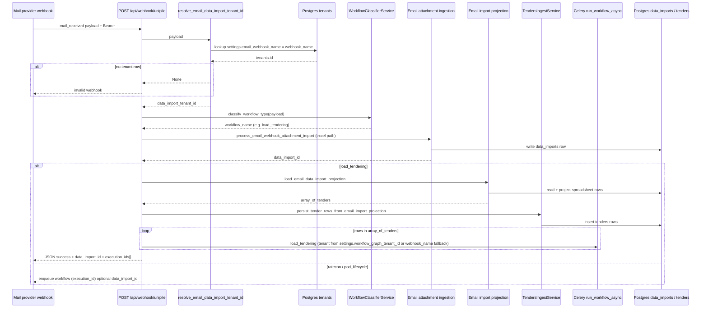
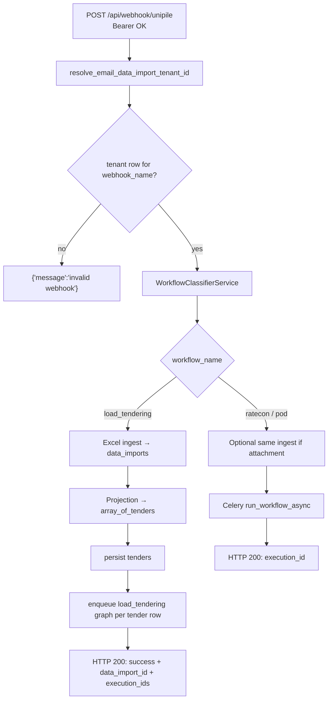

# Load tendering: email webhook to database

How an inbound **mail** webhook (currently **Unipile**) becomes **stored tenders** backed by **`data_imports`** and Postgres **`tenants`**.

## Prerequisites

| Requirement | Detail |
|------------|--------|
| **HTTP auth** | `Authorization: Bearer <UNIPILE_WEBHOOK_SECRET>`. |
| **Tenant routing** | A row in **`tenants`** whose JSON **`settings.email_webhook_name`** equals **`payload.webhook_name`** exactly. If no row matches, the API responds with `{"message": "invalid webhook"}` **before** workflow classification. |
| **Classification** | **Load tendering** when **`webhook_name`** maps to a tenant **and** the email has **`has_attachments`**, **`attachments[].extension == xlsx`**, etc. (see `WorkflowClassifierService`). |
| **Ingest path** | Unipile bytes are fetched with **`email_id`**, **`account_id`**, **`attachment_id`** from the webhook (`build_unipile_attachment_fetch_context`). |
| **LangGraph tenant (`run_workflow_async`)** | Optional **`tenants.settings.workflow_graph_tenant_id`**: must equal a top-level key in **`app/configs/tenant_configs.py`** (e.g. `"gelita"`). If omitted or blank, **`payload.webhook_name`** is reused when it is itself a **`TENANT_CONFIGS`** key; otherwise **`t3ra`** is used. Gelita installs typically set **`email_webhook_name`** and **`workflow_graph_tenant_id`** both to **`"gelita"`** for clarity. |
| **Per spreadsheet row** | One Celery **`run_workflow_async`** with **`workflow_name`**: **`load_tendering`** per projected **`tender_row`**. Response includes **`execution_ids`** in row order. Mail thread stays on **`source_email_thread_id`**; **`thread_id`** is not sent on workflow payloads so **`workflow_lifecycles`** aligns with composite **`load_id`** (`data_import_row_index` plus **`order_number`**) rather than collapsing on **`email_thread_id`**. |

Operational note: configure the Unipile webhook so its **`webhook_name`** matches the value you store under **`email_webhook_name`** in **`tenants.settings`** (for example **`"gelita"`** on both sides). Optionally set **`workflow_graph_tenant_id`** to the same **`"gelita"`** string so Postgres defines the Celery **`tenant_id`** even if **`webhook_name`** differs later.

## High-level sequence

Below, **solid lines** show the primary **load tendering** happy path after auth—**persist tenders**, then **one minimal LangGraph** run **per spreadsheet row**. Rate-con/POD mails still validate **tenant routing** first, then classify differently and enqueue **one** graph **per webhook**.



## Structural flowchart

Shows **decision gates** shared by every accepted mail webhook.



## Code map

| Piece | Responsibility |
|-------|----------------|
| **`app/api/routes.py`** | Auth, **`resolve_email_data_import_tenant_id`**, classify, ingestion, projection + tenders for **`load_tendering`**, then **one Celery enqueue per projected row**; ratecon/pod: one enqueue per webhook. |
| **`app/services/workflow_graph_tenant_resolution.py`** | **`workflow_graph_tenant_id`** vs **`webhook_name`** **`TENANT_CONFIGS`** key → **`run_workflow_async.tenant_id`**. |
| **`app/services/data_import_tenant_resolution.py`** | Maps **`payload["webhook_name"]`** → **`tenants.id`**. |
| **`app/repositories/tenants_db_repository.py`** | SQL: **`settings::jsonb->>'email_webhook_name'`**; **`settings::jsonb->>'workflow_graph_tenant_id'`** for graph Celery **`tenant_id`**. |
| **`app/services/workflow_classifier_service.py`** | **`load_tendering`** iff tenant mapping exists + `.xlsx` attachment rules. |
| **`app/services/email_webhook_attachment_ingestion.py`** | Fetch bytes, **`ingest_data`**, record **`data_imports`**. |
| **`app/services/email_import_projection.py`** | **`load_email_data_import_projection`**, **`persist_tender_rows_from_email_import_projection`** (wrapped in try/log). |
| **`app/services/data_imports_read_service.py`** | Parsed spreadsheet → **`get_projected_rows(..., projection=LOAD_TENDERING_ROW_PROJECTION)`**; call from code (workflows, scripts, tasks)—no dedicated HTTP route. |
| **`app/domain/*`** | Projection, tabular iteration, **`load_tendering_tender_rows`** mapping into DB shape. |
| **`app/repositories/tenders_repository.py`** | **`tenders` batch inserts**. |
| **Migrations** | **`20260513_01`** **`tenants`** · **`20260514_01`** **`data_imports`** · **`20260515_01`** **`tenders`** + enum. Head **`20260515_01`**. Run **`alembic upgrade head`**. |

## Reading projected rows (library reuse)

Reuse the service directly instead of REST:

```python
from app.configs.load_tendering_import_projection import LOAD_TENDERING_ROW_PROJECTION
from app.services.data_imports_read_service import DataImportsReadService

rows, meta = DataImportsReadService().get_projected_rows(
    tenant_id,
    data_import_id,
    projection=LOAD_TENDERING_ROW_PROJECTION,
)
# rows is None if no data_import for (tenant_id, id); else list[dict].
```

Ingest-facing code can use **`load_email_data_import_projection`** in **`app/services/email_import_projection.py`** (same projection, guarded I/O).

