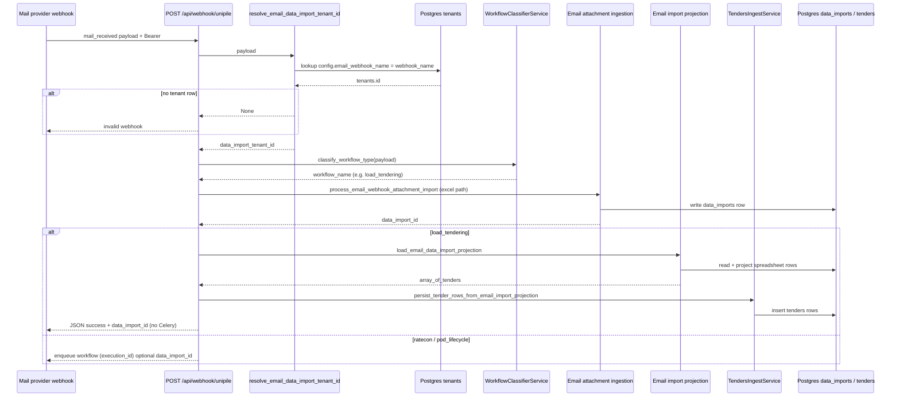
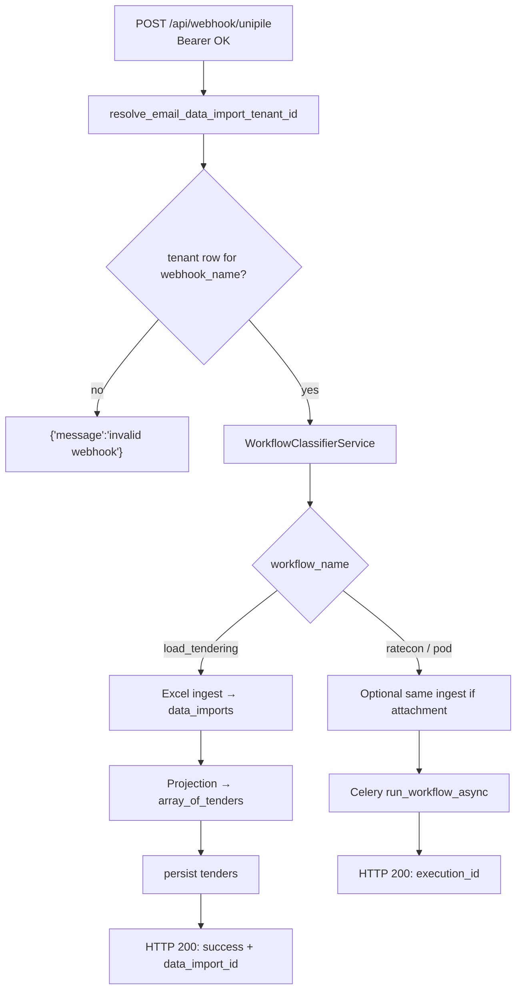

# Load tendering: email webhook to database

How an inbound **mail** webhook (currently **Unipile**) becomes **stored tenders** backed by **`data_imports`** and Postgres **`tenants`**.

## Prerequisites

| Requirement | Detail |
|------------|--------|
| **HTTP auth** | `Authorization: Bearer <UNIPILE_WEBHOOK_SECRET>`. |
| **Tenant routing** | A row in **`tenants`** whose JSON **`config.email_webhook_name`** equals **`payload.webhook_name`** exactly. If no row matches, the API responds with `{"message": "invalid webhook"}` **before** workflow classification. |
| **Classification** | **Load tendering** when **`webhook_name`** maps to a tenant **and** the email has **`has_attachments`**, **`attachments[].extension == xlsx`**, etc. (see `WorkflowClassifierService`). |
| **Ingest path** | Unipile bytes are fetched with **`email_id`**, **`account_id`**, **`attachment_id`** from the webhook (`build_unipile_attachment_fetch_context`). |

Operational note: configure the Unipile webhook so its **`webhook_name`** matches the value you store under **`email_webhook_name`** in **`tenants.config`** (for example `"gellita"` on both sides).

## High-level sequence

Below, **solid lines** show the primary **load tendering** happy path after auth. Rate-con/POD mails still validate **tenant routing** first, then classify differently and may enqueue LangGraph (`run_workflow_async`) instead of inserting tenders.

## Structural flowchart

Shows **decision gates** shared by every accepted mail webhook.

## Code map

| Piece | Responsibility |
|-------|----------------|
| **`app/api/routes.py`** | Auth, **`resolve_email_data_import_tenant_id`**, classify, ingestion, projection + tenders for **`load_tendering`**, workflow queue for others. |
| **`app/services/data_import_tenant_resolution.py`** | Maps **`payload["webhook_name"]`** → **`tenants.id`**. |
| **`app/repositories/tenants_db_repository.py`** | SQL: **`config::jsonb->>'email_webhook_name'`**. |
| **`app/services/workflow_classifier_service.py`** | **`load_tendering`** iff tenant mapping exists + `.xlsx` attachment rules. |
| **`app/services/email_webhook_attachment_ingestion.py`** | Fetch bytes, **`ingest_data`**, record **`data_imports`**. |
| **`app/services/email_import_projection.py`** | **`load_email_data_import_projection`**, **`persist_tender_rows_from_email_import_projection`** (wrapped in try/log). |
| **`app/services/data_imports_read_service.py`** | Parsed spreadsheet → normalized projected dicts (`LOAD_TENDERING_ROW_PROJECTION`). |
| **`app/domain/*`** | Projection, tabular iteration, **`load_tendering_tender_rows`** mapping into DB shape. |
| **`app/repositories/tenders_repository.py`** | **`tenders` batch inserts**. |
| **Migration** | **`alembic/versions/20260515_01_tenders_table_and_load_type_enum.py`** defines **`tenders`** and related enum (run **`alembic upgrade head`** after merge). |

## Read API

Projected spreadsheet rows without running the webhook:

- **`GET /api/data-imports/{data_import_id}/load-tendering-rows?tenant_id=...`** (tenant UUID must align with **`data_imports.tenant_id`**).
