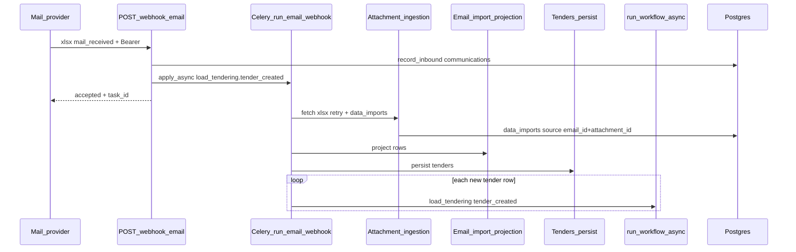

# Load tendering: email webhook to database

How an inbound **mail** webhook (currently **Unipile**) becomes **stored tenders** backed by **`data_imports`** and Postgres **`tenants`**.

## Prerequisites

| Requirement | Detail |
|------------|--------|
| **HTTP auth** | `Authorization: Bearer <UNIPILE_WEBHOOK_SECRET>`. |
| **Tenant routing** | A row in **`tenants`** whose JSON **`settings.email_webhook_name`** equals **`payload.webhook_name`** exactly. If no row matches, the API responds with `{"message": "invalid webhook"}` **before** Gelita ingress. |
| **Gelita xlsx path** | **`POST /api/webhook/email`** with a **`.xlsx`** attachment whose basename starts with **`customers_orders_`** (case-insensitive) → immediate **`accepted`** + Celery **`run_email_webhook`** (handler **`load_tendering.tender_created`**). Separate attachment **`delivery_location.xlsx`** is handled by the delivery-locations import path. |
| **Ingest path (worker)** | Unipile bytes fetched with **`email_id`**, **`account_id`**, **`attachment_id`**; attachment-level retries (3s / 6s / 12s, up to 4 tries). On persistent **`UnipileException`**, Celery **`run_email_webhook`** autoretries the full ingest up to **3** times with **~60s** between attempts (`retry_jitter` applies). |
| **LangGraph tenant (`run_workflow_async`)** | **`tenants.slug`** must equal a top-level key in **`app/configs/tenant_configs.py`** (e.g. `"gelita"`). |
| **Per spreadsheet row** | After persist, worker enqueues one **`run_workflow_async`** per new **`tender_id`**. Webhook response does **not** include **`execution_ids`** (use logs/DB/Celery). |

Operational note: configure Unipile **`webhook_name`** to match **`tenants.settings.email_webhook_name`**. Deploy **API + Celery worker** together when changing ingest tasks.

## High-level sequence (Gelita xlsx)



Ack and carrier-email paths remain **synchronous** on the API thread.

## Webhook response (xlsx)

```json
{
  "message": "accepted",
  "event_type": "tender_created",
  "task_id": "<celery-uuid>",
  "status": "queued"
}
```

Duplicate Unipile delivery for the same **`email_id`** + xlsx **`attachment.id`** may return **`status": "already_queued"`** (deterministic Celery **`task_id`**).

## Code map

| Piece | Responsibility |
|-------|----------------|
| **`app/api/routes.py`** | Auth, L1 **`resolve_unipile_tenant`**, route **`gelita`** → **`GelitaInboundEmailService`**. |
| **`app/services/gelita_inbound_email_service.py`** | L2 routing; xlsx → **`enqueue_load_tendering_tender_created_ingest`**. |
| **`app/services/email_webhook_ingest_enqueue.py`** | Deterministic Celery **`task_id`**, **`apply_async`**. |
| **`app/tasks/email.py`** | Celery **`run_email_webhook`** (`UnipileException` autoretry, 60s countdown) + handler registry (**`app/tasks/email_handlers.py`**). |
| **`app/services/load_tendering_email_ingest_service.py`** | Worker pipeline: import → project → persist → **`run_workflow_async`**. |
| **`app/services/email_webhook_attachment_ingestion.py`** | Fetch + retry + **`data_imports`** (with **`source`** keys for idempotency). |
| **`app/services/email_import_projection.py`** | Projection + tender persist. |

## Reading projected rows (library reuse)

```python
from app.configs.load_tendering_import_projection import LOAD_TENDERING_ROW_PROJECTION
from app.services.data_imports_read_service import DataImportsReadService

rows, meta = DataImportsReadService().get_projected_rows(
    tenant_id,
    data_import_id,
    projection=LOAD_TENDERING_ROW_PROJECTION,
)
```
